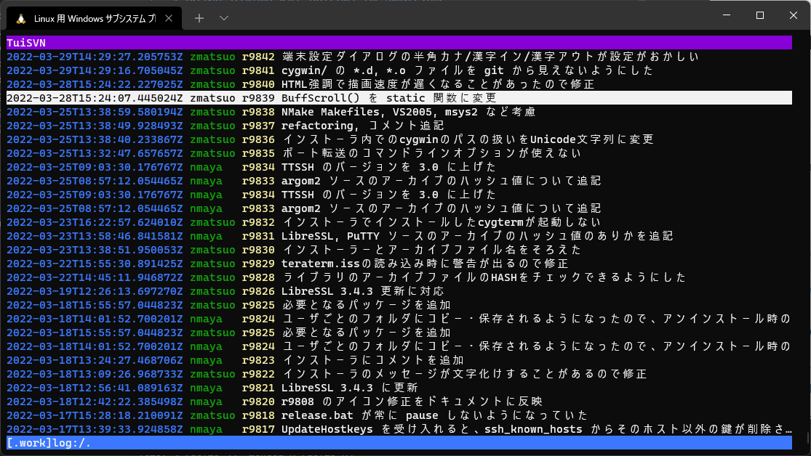

# Tuisvn: Terminal user interface for Subversion

## What is tuisvn

Tuisvn is subversion(svn) client like tig(https://github.com/jonas/tig).

## System requirement

- Linux
- Installed svn command.

## Installation

~~~shell
$ curl -L https://github.com/YoshihideShirai/tuisvn/releases/download/v0.0.1/tuisvn-v0.0
.1-linux-amd64.tar.gz | sudo tar xzvf - -C /usr/local/bin
~~~

## Key bindings

### tree screen

- k : Move-up
- j : Move-down
- Enter : change directory
- l : Enter log screen on selected file and directory.
- q : Back previous screen.

### log screen

- k : Move-up
- j : Move-down
- Enter : Enter rev screen
- q : Back previous screen.

### rev screen

- k : Move-up
- j : Move-down
- Enter : Enter diff screen on change directory.
- q : Back previous screen.

### diff screen

- k : Move-up
- j : Move-down
- q : Back previous screen.

## Usage

~~~shell
$ tuisvn [repository path or url]
~~~
If argv is omitted, repository path is set the current directory.

## Development status

Tuisvn is under development.  
Implemented status is following...
- [x] file and directory tree. (svn ls)
- [x] revision history. (svn log)
- [x] revision diff
- [ ] revision cat

## License

Copyright (C) 2022 [Yoshihide Shirai](mailto:yoshihide.shirai@gmail.com).

Licensed under the [MIT License](LICENSE).
